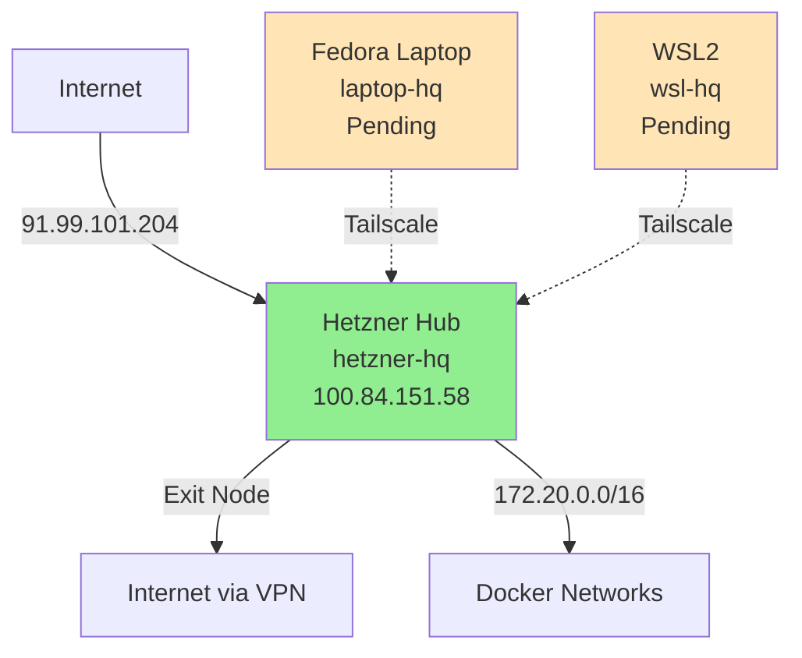

# Mesh Network Status

**Last Updated**: 2025-10-18
**Overall Status**: 🟡 DYNAMIC (Node availability varies)

## Network Overview

Three-node mesh network with dynamic availability. Only Hetzner maintains 24/7 uptime - personal devices are powered on as needed.

## Node Status

| Node | Hostname | Tailscale IP | Status | Uptime Pattern | Deployed |
|------|----------|--------------|--------|----------------|----------|
| **Hetzner Hub** | hetzner-hq | 100.84.151.58 | ✅ Always-On | 24/7 | 2025-09-07 |
| **Fedora Laptop** | laptop-hq | 100.84.2.8 | 🔄 Dynamic | On-demand | 2025-09-06 |
| **WSL2** | wsl-fedora-kbc | 100.88.131.44 | 🔄 Dynamic | Work hours | 2025-09-07 |

> **Live Status**: Node availability changes throughout the day. Check `tailscale status` for real-time connectivity.

## Network Configuration

### Tailscale Network
- **Network Range**: 100.64.0.0/10 (CGNAT space)
- **Hub Node**: 100.84.151.58 (hetzner-hq)
- **Exit Node**: Enabled on Hetzner
- **Advertised Routes**: 172.20.0.0/16 (Docker networks)
- **DERP Relay**: Nuremberg (4.1ms latency)
- **Auth Account**: jeffreyverlynjohnson@gmail.com

### Access Methods

#### Via Tailscale Mesh (Preferred)
```bash
# Once Tailscale is installed on client
ssh verlyn13@hetzner-hq -p 2222
ssh verlyn13@100.84.151.58 -p 2222
```

#### Direct Access (Always Available)
```bash
# Public IP - works from anywhere
ssh verlyn13@91.99.101.204 -p 2222
```

## Services Accessibility

| Service | Internal (Mesh) | External | Status |
|---------|-----------------|----------|--------|
| SSH | 100.84.151.58:2222 | 91.99.101.204:2222 | ✅ Active |
| Infisical | 100.84.151.58:8080 | secrets.jefahnierocks.com | ✅ Active |
| Docker Networks | 172.20.0.0/16 | - | ✅ Routed |

## Repository Deployment

### Hetzner Server
- **Location**: `/opt/mesh-infra`
- **Branch**: main
- **Last Sync**: 2025-09-07
- **Remote**: git@github.com:verlyn13/mesh-infra.git

## Quick Commands

### Check Network Status
```bash
# On Hetzner
sudo tailscale status
sudo tailscale netcheck
sudo tailscale ip -4

# View connected peers
sudo tailscale status --peers
```

### Join New Nodes
```bash
# On new node (laptop/WSL)
cd ~/Projects/verlyn13/mesh-infra
make init-day1
```

## Network Diagram



## Node Availability Patterns

### Expected Uptime
- **Hetzner (hetzner-hq)**: 24/7 always-on - serves as network backbone
- **Laptop (laptop-hq)**: On-demand - typically offline outside active use
- **WSL2 (wsl-fedora-kbc)**: Work hours - unavailable evenings/weekends

### Service Resilience
- **1 Node Active** (Hetzner only): Core services and remote access available
- **2 Nodes Active**: Full development workflow possible
- **3 Nodes Active**: Maximum functionality with cross-platform development

### Real-time Status Check
```bash
# Check live mesh status
tailscale status

# Ping specific nodes
tailscale ping laptop-hq
tailscale ping wsl-fedora-kbc
```

## Troubleshooting

### If Tailscale Connection Fails
1. Check service: `sudo systemctl status tailscaled`
2. View logs: `sudo journalctl -u tailscaled -f`
3. Restart: `sudo systemctl restart tailscaled`
4. Re-auth: `sudo tailscale up --force-reauth`

### Emergency Access
- Direct SSH: `ssh verlyn13@91.99.101.204 -p 2222`
- Hetzner Console: https://console.hetzner.cloud
- See: `infra/ESCAPE_HATCHES.md`

## Performance Metrics

- **DERP Latency**: 4.1ms (Nuremberg)
- **Tailscale Version**: 1.86.2
- **Uptime**: Since 2025-09-07

## Security Status

- ✅ WireGuard encryption active
- ✅ No public ports exposed (except SSH 2222)
- ✅ Exit node capability enabled
- ✅ Docker networks accessible only via mesh
- ✅ SSH key authentication required